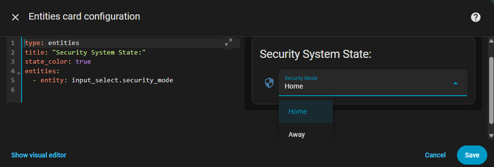
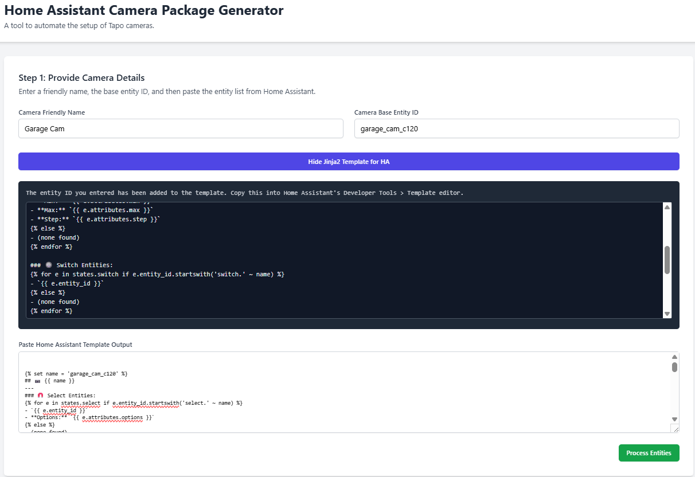
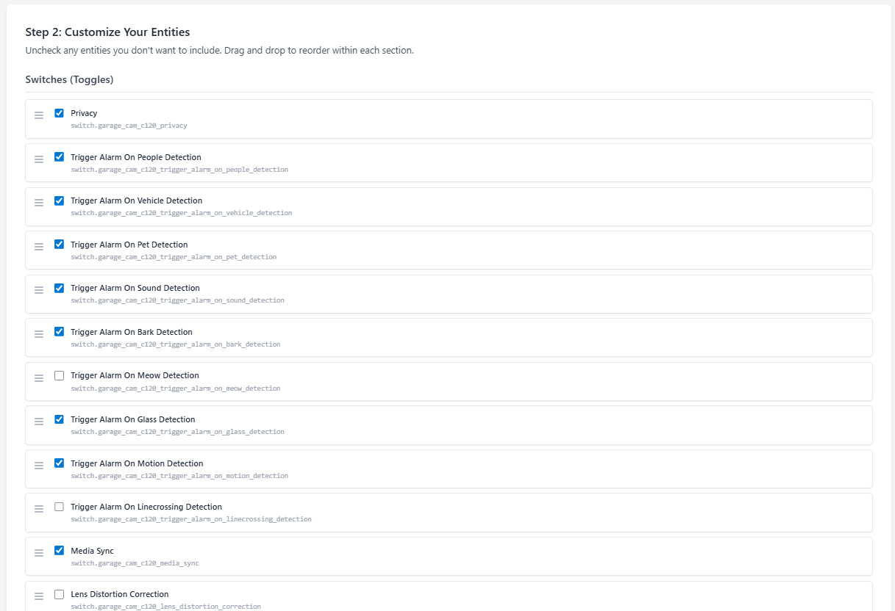
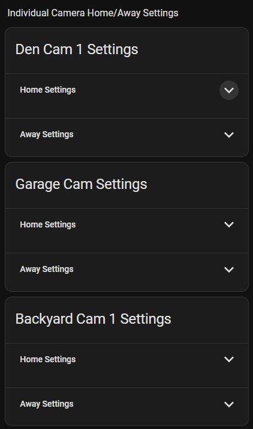
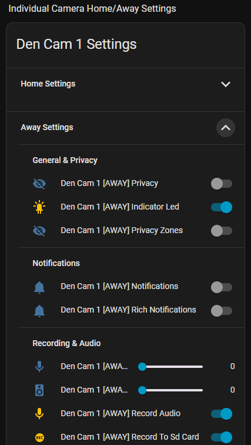

# HA Tapo Camera Tool

A web-based tool to automate the setup of Tapo cameras in Home Assistant. It generates all the necessary YAML for a sophisticated setup, allowing you to change camera settings based on your home's state (e.g., "Home" or "Away").

## Overview

Modern smart cameras like the Tapo series have dozens of settings (motion detection, notifications, privacy mode, etc.). Manually creating a system to control these settings based on whether you are home or away can be a complex and time-consuming task in Home Assistant.

This tool streamlines that entire process. It inspects your camera, allows you to select the features you care about, and automatically generates the three key components needed for a complete solution.

## How the Tool Works

The tool acts as a three-step wizard that guides you through the complex configuration process:

1.  **Data Input and Parsing:** The tool guides you to use a Jinja2 template in Home Assistant's Developer Tools to get a complete list of all entities associated with your camera. When you paste this text back into the tool, a JavaScript function parses it, converting it into a structured list that the application can understand.

2.  **User Customization:** The tool then displays the entities in a user-friendly, interactive list where you can uncheck settings you don't need and drag-and-drop items to set their order on the final Lovelace card.

3.  **YAML Generation:** When you click "Generate," the tool takes your customized list and runs it through three separate generator functions to produce the final Package, Lovelace Card, and Automation YAML files.

## Features

The tool generates three distinct YAML files:

* **Package File:** Creates all the necessary helper entities (`input_boolean`, `input_select`, `input_number`) to store your settings for both "Home" and "Away" modes.
* **Lovelace Settings Card:** A user-friendly card for your dashboard that allows you to easily configure the settings for each mode.
* **"Smart" Automation:** An efficient, conditional automation that monitors your home's state and applies the appropriate settings to your camera. It only sends commands for settings that need to be changed, minimizing traffic and avoiding rate-limiting issues.

## Prerequisites

Before using this tool, you must have the following set up in your Home Assistant instance.

### 1. Install the Tapo Control Integration

This tool is specifically designed to work with entities created by the **Tapo Control** custom integration.

* **Installation Link:** [https://github.com/JurajNyiri/HomeAssistant-Tapo-Control](https://github.com/JurajNyiri/HomeAssistant-Tapo-Control)
* It is highly recommended to install this via HACS.
* *This tool may work with cameras added through other means, but it has not been tested.*

### 2. Add Your Tapo Camera to Home Assistant

Follow the Tapo Control integration's instructions to add your camera to Home Assistant. Make a note of the camera's base entity ID (e.g., `driveway_cam_a_c402`), as you will need it for the tool.

### 3. Create the Home/Away Input Helper

The entire system relies on a central helper entity that defines your home's current state. If you don't already have one, you need to create an `input_select` helper.

1.  In Home Assistant, navigate to **Settings > Devices & Services > Helpers**.
2.  Click **Create Helper** and choose **Dropdown**.
3.  Fill in the fields as follows:
    * **Name:** `Security Mode`
    * **Icon:** `mdi:security`
    * **Option 1:** `Home`
    * **Option 2:** `Away`
4.  Click **Create**. This will create the `input_select.security_mode` entity that the generated automation will use.

Here is an example of a selector card uding the helper, to allow manual selection of Security Mode State (Home or Away):



## How to Use the Tool

### Step 1: Download and Run the Tool

1.  Download the asset `.zip` file from the latest release: [](https://github.com/acolod/ha-tapo-camera-tool/releases/latest)
2.  Unzip the folder to a location on your computer.
3.  Open the unzipped folder and double-click the `index.html` file to open the tool in your browser.

### Step 2: Get Camera Entities from Home Assistant

1.  In the tool, enter a **Camera Friendly Name** (e.g., `Driveway Cam A`) and the **Camera Base Entity ID** (e.g., `driveway_cam_a_c402`).
2.  Click the **"Show Jinja2 Template for HA"** button.
3.  Copy the entire Jinja2 template.
4.  In Home Assistant, go to **Developer Tools > Template**.
5.  Paste the template and copy the entire result from the right side.

### Step 3: Generate the Configuration Files

1.  Return to the tool and paste the entity list you just copied from Home Assistant into the large text area.
2.  Click the **"Process Entities"** button.
3.  A new section will appear, listing all your camera's entities, grouped by type. Review this list, unchecking any entities you don't need and reordering them via drag-and-drop.
4.  Once you are happy with the list, click the **"Generate All Files"** button. The tool will instantly generate the three required YAML configuration files.

| Tool Interface (Input & Entity List) | Generated YAML Output |
| :---: | :---: |
|  |  |

## Deployment in Home Assistant

### 1. The Package File

1.  Copy the contents of the **"Package File"** output box.
2.  In your Home Assistant `/config` directory, find or create a folder named `packages`.
3.  Create a new file inside `packages`, named after your camera (e.g., `camera_driveway_a.yaml`).
4.  Paste the copied YAML into this new file.
5.  Ensure your main `configuration.yaml` is set up to load packages:
    ```yaml
    homeassistant:
      packages: !include_dir_named packages
    ```
6.  Go to **Developer Tools > YAML** and **Check Configuration**, then **Restart Home Assistant**.

### 2. The Lovelace Settings Card

1.  After HA has restarted, copy the contents of the **"Lovelace Settings Card"** output box.
2.  Navigate to the dashboard where you want the card, enter **Edit Dashboard** mode, and click **+ Add Card**.
3.  Choose the **Manual** card, delete the placeholder content, and paste the copied YAML. Save the card.

| Settings Card | Setting Card (Away Expanded) |
| :---: | :---: |
|||

### 3. The Automation

1.  Copy the contents of the **"Automation"** output box.
2.  Go to **Settings > Automations & Scenes**.
3.  Click **+ Create Automation** and choose **Create new automation**.
4.  Click the three-dots menu in the top-right and select **Edit in YAML**.
5.  Delete the placeholder content and paste the copied automation YAML. Save the automation.

## Final Testing

Your setup is complete. To test it, go to your new Lovelace settings card and configure different settings for the "Home" and "Away" sections. Then, change the state of the `input_select.security_mode` helper. You should see the settings on your camera update accordingly.

## Supported Cameras

This tool should work for most modern Tapo cameras supported by the Tapo Control integration. It has been tested and confirmed working with the following models:

* **Tapo C402**
* **Tapo C425**
* **Tapo C120**
